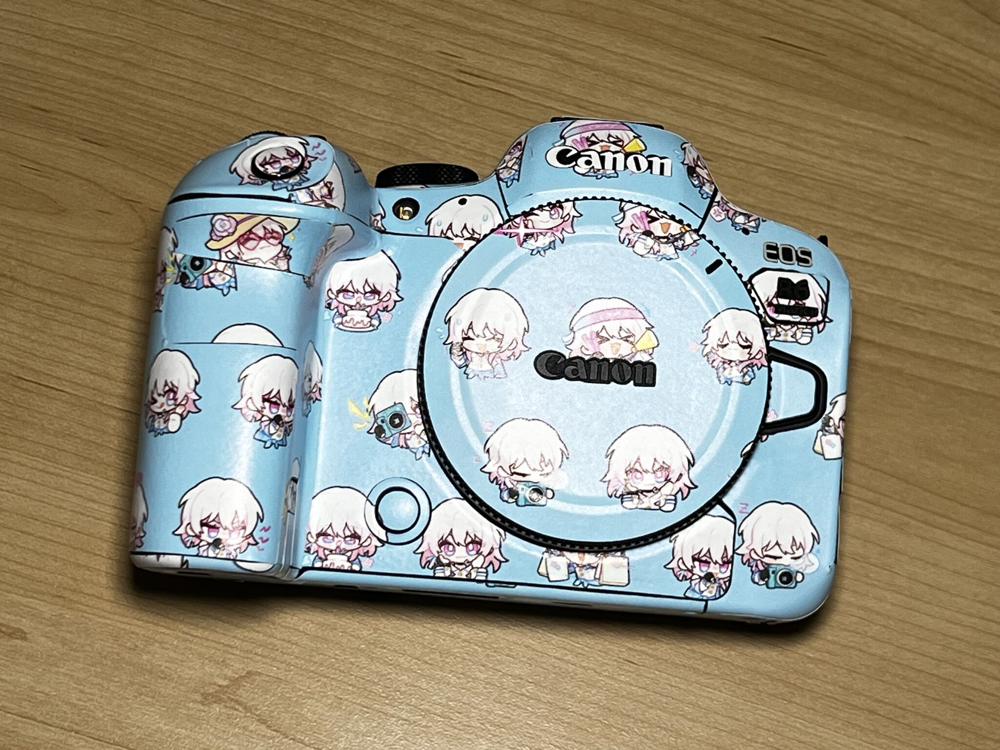

# RandomLayoutSticker

- [Introduction 简介](#introduction-简介)
- [Usage 使用方法](#usage-使用方法)
- [推荐相机贴纸定制店铺](#推荐相机贴纸定制店铺)（自用无广，欢迎店家给我广告费，我就把这句话删了）

## Introduction 简介
This is for layout sticker in random order and use it for a certain purpose.

这个脚本可以把一些表情包随机排列，然后输出到一个图片上，你可以把这个图片打印出来，然后用于某些场景。

If you don't want the huge sample image `output_march7th.png`, don't clone it, just download the `layout.py` and install `pillow`.

如果你不需要这张硕大的例图 `output_march7th.png`，那就不要下载整个仓库，下载 `layout.py` 并安装 `pillow` 就好。

For example, you can print it and use it on a camera. Say\~Cheese\~

比如贴到相机上。懂不懂赵相机的含金量。

## Usage 使用方法
1. Put the stickers in a folder, say "input".

    把表情包放到一个文件夹里，比如 "input"。
2. Install necessary libraries

   安装必要的python库
   
    `pip install -r requirements.txt`
3. Edit the script's configuration part (Line 7-12).

    编辑脚本的配置部分（第7-12行）。
4. Run the script.

    运行脚本。
5. Check the output.

    查看输出。

## 推荐相机贴纸定制店铺
[淘宝景叮店](https://m.tb.cn/h.g3u2AJTCspsWc69?tk=UXeLWDec3aK)
